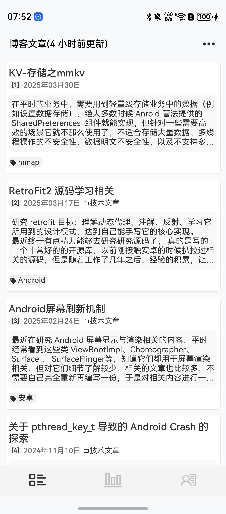
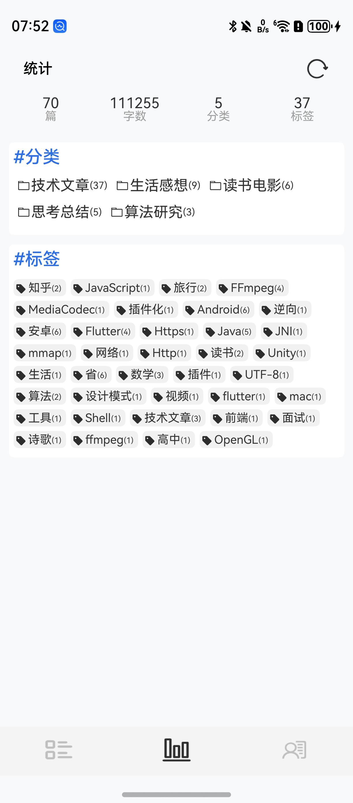
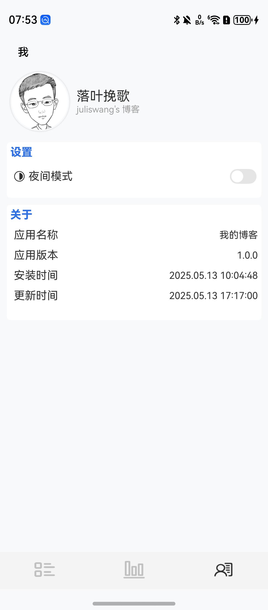
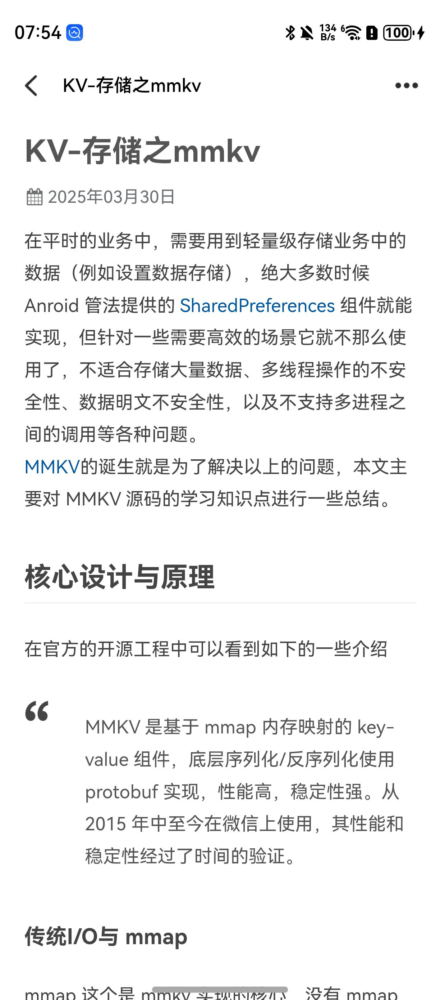
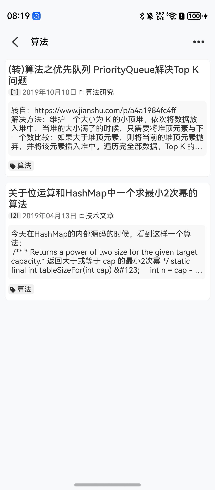
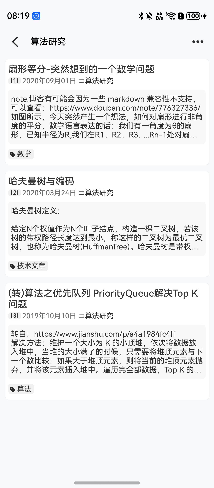
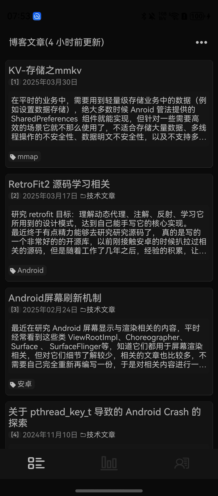
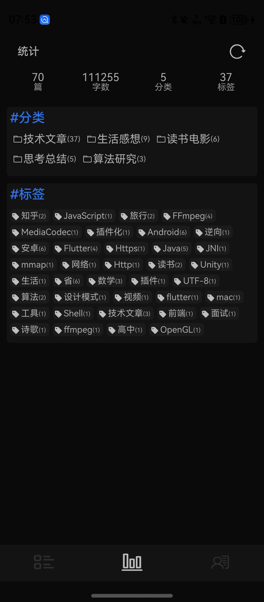
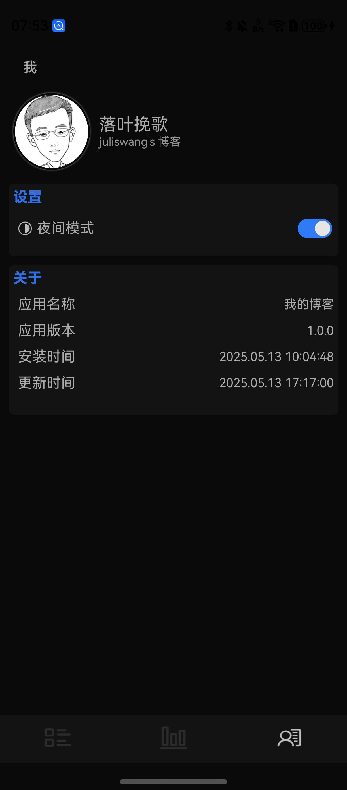

基于 Hexo 博客内容开发的鸿蒙平台 App

## Features

- 博客列表分页加载
- 文章详情加载
- 文章按分类/标签展示
- 文章内容统计
- 深色/浅色模式切换

## Screenshots

### 浅色模式

      
      
      

      
      
      

### 浅色模式

      
      
      

## Key dependencies

### Hexo

- [Hexo](https://hexo.io/) 快速、简洁且高效的博客框架
- [hexo-generator-wxapi](https://github.com/ryanuo/hexo-generator-wxapi) 用于将 Hexo 博客内容生成 api 风格的.json文件
- [七牛云](https://www.qiniu.com/) 提供对图片和.json文件 CDN加速

### HarmonyOS
- [ArkTS](https://developer.huawei.com/consumer/cn/doc/harmonyos-guides/arkts) ArkTS在TypeScript（简称TS）生态基础上做了进一步扩展，保持了TS的基本风格，同时通过规范定义强化开发期静态检查和分析，提升代码健壮性，并实现更好的程序执行稳定性和性能。

- [ArkUI](https://developer.huawei.com/consumer/cn/doc/harmonyos-guides/arkui)  ArkUI（方舟UI框架）为应用的UI开发提供了完整的基础设施，包括简洁的UI语法、丰富的UI功能（组件、布局、动画以及交互事件），以及实时界面预览工具等，可以支持开发者进行可视化界面开发。

- [ohos_pull_to_refresh](https://gitee.com/openharmony-sig/ohos_pull_to_refresh) 列表加载/刷新控件(没有'No more'的状态)

- [MMKV](https://github.com/Tencent/MMKV) 是基于 mmap 内存映射的 key-value 组件

## 配置自己的博客

step1 基于 [hexo-generator-wxapi](https://github.com/ryanuo/hexo-generator-wxapi) 生成对应的 json 并部署(github or 七牛云)

step2 [AppConfig](entry/src/main/ets/componet/config/AppConfig.ets) 配置自己的博客数据